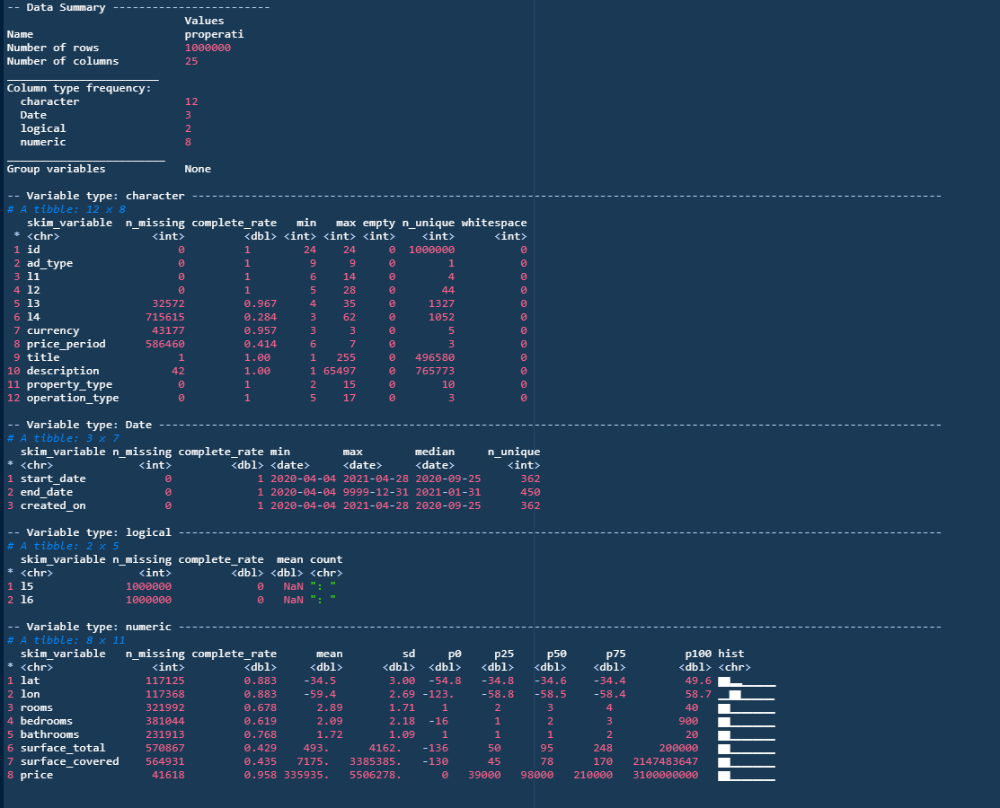

layout: true
  
<div class="my-footer"><span>Juan Pablo Ruiz Nicolini | @TuQmano | <a href="https://tuqmano.ar/">www.tuqmano.ar</a></span></div> 

---
class: inverse, center, middle

```{r setup, include=FALSE}
options(htmltools.dir.version = FALSE)
knitr::opts_chunk$set(collapse = TRUE,
                      fig.retina = 3,
                      out.width = 300, ### control plot size
                      cache = TRUE,
                      warning = FALSE,
                      message = FALSE)


```


```{r xaringan, include=FALSE}
xaringanExtra::use_xaringan_extra(c("tile_view", "animate_css", "tachyons", "extra_styles", "scribble", "editable", "broadcast", "webcam"))


```

```{r extrasXaringan, echo=FALSE}
xaringanExtra::use_extra_styles(
  hover_code_line = TRUE,         #<<
  mute_unhighlighted_code = TRUE  #<<
)

xaringanExtra::use_progress_bar(color = "#fdbd15", location = "top")


```


# EJERCITACION

## https://bit.ly/2ThjWEj

---

class: inverse, center, middle

# Sesion 4

## Domar los Datos II

### + [`{dplyr}`](https://dplyr.tidyverse.org/)

---

class: inverse, center, middle

# Datos provistos por <a href='https://www.properati.com.ar'>Properati</a>


```{r, eval = F}

   
  datos <- vroom::vroom("https://storage.googleapis.com/properati-data-public/ar_properties.csv.gz")
   


```


---

# Inspeccionamos dataset

```{r, eval=F}

skimr::skim(datos)

```


```{r, echo=FALSE, out.width= '100%'}




```


---

background-image: url(https://github.com/TuQmano/hex-stickers/raw/master/PNG/dplyr.png)
background-position: 95% 5%
background-size: 10%


## + verbos de `{dplyr}`

--

* `n()`

--

* `slice()` (y variantes:  `slice_*()`)

--

* `rename()`

--

* `case_when()` (re versión de `ifelse()`)

--

* Variantes de `mutate_*()` y `summarise_*()`

--

background-image: url(https://github.com/TuQmano/hex-stickers/raw/master/PNG/dplyr.png), url(https://www.tidyverse.org/blog/2020/06/dplyr-1-0-0/dplyr.png)
background-position: 95% 5%, 95% 50%
background-size: 10%, 10%


## [*nuevo* `{dplyr}` `r icon::fa("link")`](https://www.tidyverse.org/blog/2020/06/dplyr-1-0-0/) 

* `across()` 

--

* grupos por filas con `rowwise()`


---

background-image: url(https://www.tidyverse.org/blog/2020/06/dplyr-1-0-0/dplyr.png)
background-position: 95% 5%
background-size: 10%


## Datos relacionales 


```{r joinsGIF, echo = FALSE}
knitr::include_graphics("https://www.garrickadenbuie.com/project/tidyexplain/images/left-join-extra.gif")
```


[`r icon::fa("link")` Tidy Explain, Garrick Aden‑Buie](https://www.garrickadenbuie.com/project/tidyexplain/)


---

background-image: url(https://www.tidyverse.org/blog/2020/06/dplyr-1-0-0/dplyr.png)
background-position: 95% 5%
background-size: 10%


## Datos relacionales 

* Uniones de transformación (del inglés _mutating joins_), que agregan nuevas variables a un data frame a partir de las observaciones coincidentes en otra tabla (*vg* `left_join()`)

--

* Uniones de filtro (del inglés _filtering joins_), que filtran observaciones en un _data frame_ con base en si coinciden o no con una observación de otra tabla (*vg* `anti_join()`).


--


* Operaciones de conjuntos (del inglés _set operations_), que tratan las observaciones como elementos de un conjunto (*vg* `set_diff()`).


`r icon::fa("link")` [Datos Relacionales - R4DS](https://es.r4ds.hadley.nz/datos-relacionales.html)


---
class: inverse, middle, center

# Domar los Datos
### (II Parte) 

---


background-image: url(https://github.com/rstudio/hex-stickers/raw/master/PNG/stringr.png)
background-position: 95% 5%
background-size: 10%

# Domar los datos II

## Caracteres 

--

* Funciones que permiten manipular caracteres individuales dentro de las cadenas en vectores de caracteres (_vg_ : **`str_sub(string = x, start = 1, end = 4)`**).

--

* Herramientas para agregar, eliminar y manipular espacios en blanco (_vg_ : **`str_pad(string = x , width = 2 , side = "left" , pad = 0)`**).

--

* Funciones que detectan coincidencia de patrones como  las _expresiones regulares_ -[_regex_ `r icon::fa("link")`](https://stringr.tidyverse.org/articles/regular-expressions.html): 
**`str_detect(string = x, pattern = ":digits:")`**


--

[`r icon::fa("link")``{stringr}`](https://stringr.tidyverse.org/articles/stringr.html)

---
background-image: url(https://github.com/rstudio/hex-stickers/raw/master/PNG/lubridate.png)
background-position: 95% 5%
background-size: 10%

# Domar los datos II

## Días y horas

`{lubridate}` incluye una gran variedad de funciones para **(a) *paresear* días y horas**; **(b) crear y extraer información**; (c) manejar zonas horarias (_tz_); y hasta calcular intervalos de tiempo y _aritmética de tiempo_

--


```{r, echo = TRUE}
library(lubridate) # (a)
dmy("6 de octubre de 2020")
```

--


```{r, echo = TRUE}
library(lubridate) # (b)
today() + 365
```

--

[`r icon::fa("link")``{lubridate}`](https://lubridate.tidyverse.org/index.html)


---

background-image: url(https://github.com/rstudio/hex-stickers/raw/master/PNG/forcats.png)
background-position: 95% 5%
background-size: 10%

# Domar los datos II

## Variables categóricas


> *Los factores son útiles cuando se tiene datos categóricos, variables que tienen un conjunto de valores fijo y conocido, y cuando se desea mostrar los vectores de caracteres en orden no alfabético* **R4DS - <https://es.r4ds.hadley.nz/factores.html>**
--


* `fct_reorder()` > modifica el orden

--

* `fct_recode()` > modifica valores (no niveles)

--

* `fct_collapse()`> colapsar es útil para re codificar muchos niveles 
--

* `fct_lump()` > agrupa 

