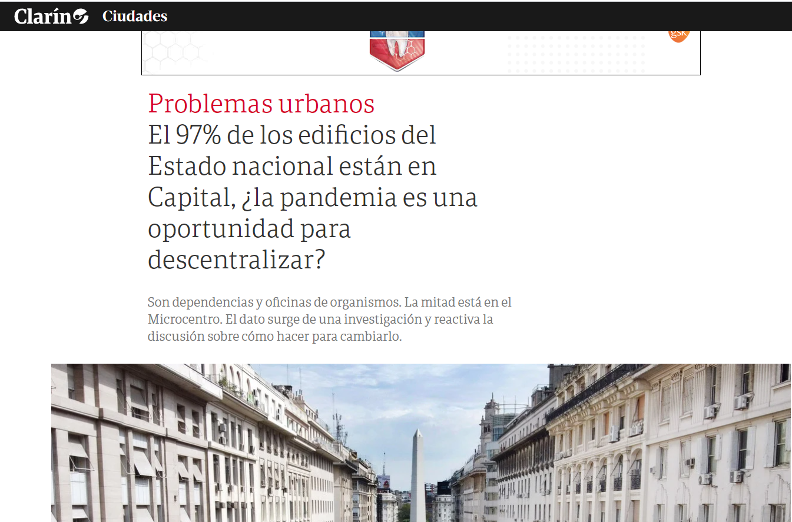
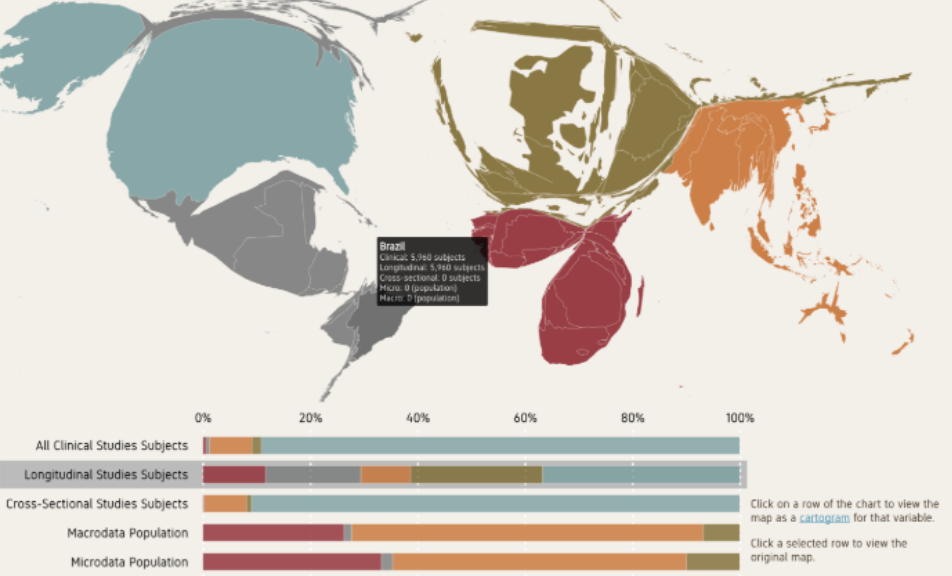
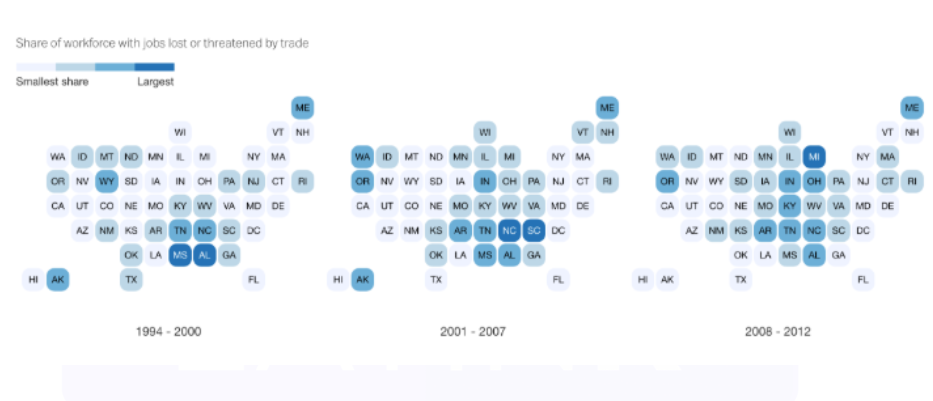
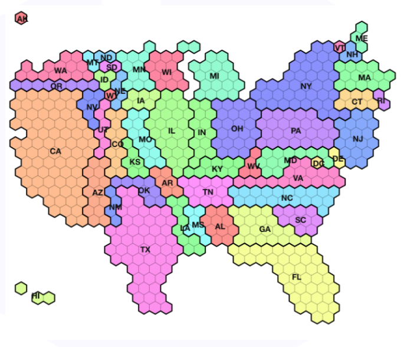

layout: true
  
<div class="my-footer"><span>Juan Pablo Ruiz Nicolini | @TuQmano | <a href="https://tuqmano.ar/">www.tuqmano.ar</a></span></div> 


```{r setup, include=FALSE}
options(htmltools.dir.version = FALSE)
knitr::opts_chunk$set(collapse = TRUE,
                      fig.retina = 3,
                      cache = TRUE,
                      warning = FALSE,
                      message = FALSE)


```


```{r xaringan, include=FALSE}
xaringanExtra::use_xaringan_extra(c("tile_view", "animate_css", "tachyons", "extra_styles", "scribble", "editable", "broadcast", "webcam"))


```

```{r extrasXaringan, echo=FALSE}
xaringanExtra::use_extra_styles(
  hover_code_line = TRUE,         #<<
)

xaringanExtra::use_progress_bar(color = "#fdbd15", location = "top")


```

---
class: inverse

```{r, echo=FALSE, out.width='100%'}

```
 
 Tiscornia: https://rpubs.com/pablotisco/inmuebles_estado


---

class: inverse

# TRABAJO FINAL

## Contenido del trabajo:
* Un informe en Rmarkdown (.Rmd) o Script (.R) con comentarios, en donde se pueda evidenciar el armado de un proyecto, recorriendo las siguientes etapas:

* Planteo de la pregunta y mínima presentación del tema.

* Descripción de los pasos realizados para encarar el problema, sin eludir posibles obstáculos durante el proceso.

* Importación de datos o acceso de los mismos a través de la metodología scrapping

* Limpieza, tratamiento y transformación de datos.

* Visualización de la información

* Comentarios a modo de conclusión respecto a los resultados obtenidos, tanto en lo que refiere a la información producida como a lo enfrentado durante el procesamiento de datos

**Formato de entrega:**  Repositorio en Github cuyo contenido sea el proyecto, estructurado y ordenado para el análisis.

---

class:  middle, center, inverse


### Data Viz (III)

#### Distintas formas de representar información geográfica


---

class: center

## Elegir el gráfico correcto para nuestros datos


```{r include=FALSE}
# Libraries
library(tidyverse)
library(hrbrthemes)
library(viridis)
library(patchwork)

# create 3 data frame:
data1 <- data.frame( name=letters[1:5], value=c(17,18,20,22,24) )
data2 <- data.frame( name=letters[1:5], value=c(20,18,21,20,20) )
data3 <- data.frame( name=letters[1:5], value=c(24,23,21,19,18) )

# Plot
plot_pie <- function(data, vec){

ggplot(data, aes(x="name", y=value, fill=name)) +
  geom_bar(width = 1, stat = "identity") +
  coord_polar("y", start=0, direction = -1) +
  scale_fill_viridis(discrete = TRUE,  direction=-1) + 
  geom_text(aes(y = vec, label = rev(name), size=4, color=c( "white", rep("black", 4)))) +
  scale_color_manual(values=c("black", "white")) +
  theme_ipsum() +
  theme(
    legend.position="none",
    plot.title = element_text(size=14),
    panel.grid = element_blank(),
    axis.text = element_blank(),
    legend.margin=unit(0, "null")
  ) +
  xlab("") +
  ylab("")
  
}


# A function to make barplots
plot_bar <- function(data){
  ggplot(data, aes(x=name, y=value, fill=name)) +
    geom_bar( stat = "identity") +
    scale_fill_viridis(discrete = TRUE, direction=-1) + 
    scale_color_manual(values=c("black", "white")) +
    theme_ipsum() +
    theme(
      legend.position="none",
      plot.title = element_text(size=14),
      panel.grid = element_blank(),
    ) +
    ylim(0,25) +
    xlab("") +
    ylab("")
}


```


```{r, echo=FALSE}
a <- plot_pie(data1, c(10,35,55,75,93))  + theme_void() + theme(legend.position = "none")
b <- plot_pie(data2, c(10,35,53,75,93))  + theme_void() + theme(legend.position = "none")
c <- plot_pie(data3, c(10,29,50,75,93)) + theme_void() + theme(legend.position = "none")
a + b + c
```


---
class: center

## Elegir el gráfico correcto para nuestros datos

```{r, echo=FALSE, out.width='50%'}


a <- plot_pie(data1, c(10,35,55,75,93))  + theme_void() + theme(legend.position = "none")
b <- plot_pie(data2, c(10,35,53,75,93))  + theme_void() + theme(legend.position = "none")
c <- plot_pie(data3, c(10,29,50,75,93)) + theme_void() + theme(legend.position = "none")


d <- plot_bar(data1)  + theme_minimal() + theme(legend.position = "none")
e <- plot_bar(data2)  + theme_minimal() + theme(legend.position = "none")
f <- plot_bar(data3)  + theme_minimal() + theme(legend.position = "none")


(a + b + c) / (d + e + f )
```

FUENTE: https://www.data-to-viz.com/caveat/pie.html#


---

## _Único caso útil para un gráfico de tortas_
```{r, echo=FALSE, out.width='80%'}

knitr::include_graphics("figs/piramide.png")

```


--

### Tampoco para tanto 

_A case for pie charts_ - [Fundamentals of Data Visualization, Claus Wilke](https://clauswilke.com/dataviz/visualizing-proportions.html#a-case-for-pie-charts)

---
class:inverse


## El problema de los mapas coropléticos

### #Election2020 

> **"_Trump loves this 2016 election map because it suggests the majority of the country supports him (...)_"** **([NYT](https://www.nytimes.com/interactive/2020/10/30/opinion/election-results-maps.html))**

```{r, echo=FALSE, out.width="100%"}
knitr::include_graphics("figs/nyt.png")
```

---

## El problema de los mapas coropléticos

### ARGENTINA 2015

```{r, echo= FALSE, out.width='90%'}

knitr::include_graphics("https://github.com/TuQmano/votemapARG/blob/main/output/001.png?raw=true")

```


---

## ARGENTINA 2015 ([repo](https://github.com/TuQmano/votemapARG/))

```{r, echo= FALSE, out.width='90%'}

knitr::include_graphics("https://github.com/TuQmano/votemapARG/raw/main/animacion.gif")

```


---

class: inverse, center, middle

## Alternativas de visualización _geo_


---

class: center, middle

## Mapa Coroplético

```{r, echo= FALSE,out.width='100%'}

knitr::include_graphics("figs/choroplet.png")

```


---


class: center, middle

## Cartogramas

```{r, echo= FALSE,out.width='100%'}



```


---

class: center, middle

## _Tilemaps_

```{r, echo= FALSE,out.width='100%'}

knitr::include_graphics("figs/tilemap.png")

```


---


class: center, middle

## _Faceted tilemaps_

```{r, echo= FALSE,out.width='100%'}



```


---


class: center, middle

## Tilegrams

```{r, echo= FALSE,out.width='100%'}



```

---

class: inverse , middle

## Limitaciones varias

* Visualizar una variable / valor por unidad geográfica

--

* Solo hace uso del color para codificación visual (dificultad para calcular diferencias)

--

* Sesgo a favor de grandes unidades geográficas


---

background-image: url(https://hafen.github.io/geofacet/reference/figures/logo.png)
background-position: 95% 5%
background-size: 10%

class: inverse 

# Grillas como (si fueran) mapas

[`r icon::fa("link")``{geofacet}`](https://ryanhafen.com/blog/geofacet/)


```{r, echo=FALSE, fig.asp=1/2, out.width="100%"}
library(geofacet)
grid_preview(us_state_grid1)
```


---

class: inverse


# Ventajas de `{geofacet}`


[`r icon::fa("link")` _Voto Popular_ vs _Colegio Electoral_](https://github.com/TuQmano/popular_vote)

```{r, echo = FALSE, out.width='70%'}
knitr::include_graphics("https://raw.githubusercontent.com/TuQmano/popular_vote/master/plots/turnount_ts.png")

```


* se pueden graficar múltiples variables para cada unidad geográfica

--

* se pueden aplicar otros esquemas de codificación visual más allá del color

--

* cada unidad geográfica tiene asignada la misma proporción espacial


---

background-image: url(https://hafen.github.io/geofacet/reference/figures/logo.png)
background-position: 95% 5%
background-size: 10%

# [Grillas colaborativas](https://github.com/hafen/geofacet/issues/102)

### [`geofacet::grid_design()`](https://hafen.github.io/grid-designer/#data=)

```{r, out.width="35%", fig.asp=3/2}
library(geofacet)
grid_preview(argentina_grid2)
```

(Comunas [_gist_](https://gist.githubusercontent.com/TuQmano/2fb70e11c6500176427bb3b60604b79d/raw/ebe2889269d403dd05ab1db9e6ad624fa02a6e63/comunas.csv))

---

background-image: url(https://github.com/electorArg/geofaceteAR/blob/master/hex/ggplot2.png?raw=true)
background-position: 95% 5%
background-size: 10%

# Las grillas de Argentina

.pull-left[
### **LatinR 2018** - [Abstract](https://github.com/TuQmano/geofacet_ARG/blob/master/.LatinR/Geofaceting_Argentina_RuizNicolini.pdf) 

#### [`r emojifont::emoji("bar_chart")` Slides](https://www.researchgate.net/publication/327382101_Geofaceting_Argentina_LatinR_2018) 

#### [`r emojifont::emoji("package")` {geofaceteAR}](https://electorarg.github.io/geofaceteAR/) 

#### [`r emojifont::emoji("keyboard")` blogpost](https://www.tuqmano.com/2020/05/22/empaquetar/)
]

.pull-right[

```{r, fig.align='left', echo=FALSE}
tucgrid <- polAr::get_grid("TUCUMAN")
geofacet::grid_preview(tucgrid)
```
]


---

background-image: url(https://github.com/PoliticaArgentina/geoAr/raw/main/man/figures/logo.png)
background-position: 95% 2%
background-size: 15%


# `geofacetAr` en `{geoAr}`

## `get_grid()`


```{r}


(tucuman <- geoAr::get_grid(district = "TUCUMAN"))


```

---

background-image: url(https://github.com/PoliticaArgentina/geoAr/raw/main/man/figures/logo.png)
background-position: 95% 2%
background-size: 15%


# `geofacetAr` en `{geoAr}`


```{r, out.height='70%'}


geofacet::grid_preview(tucuman)


```


---

background-image: url(https://github.com/PoliticaArgentina/geoAr/raw/main/man/figures/logo.png)
background-position: 95% 2%
background-size: 15%


# `geofacetAr` en `{geoAr}`

## `recode_grid()`


```{r, out.height='70%'}

tucuman %>% 
  recode_grid(type = "indec") %>% 
geofacet::grid_preview()


```


---

background-image: url(https://upload.wikimedia.org/wikipedia/commons/thumb/1/13/Leaflet_logo.svg/1200px-Leaflet_logo.svg.png)
background-position: 95% 5%
background-size: 20%


### Mapas interactivos 

[`r icon::fa("link")``{leaflet}`](https://rstudio.github.io/leaflet/)

```{r, echo = FALSE, out.width="100%", cache=FALSE}
library(leaflet)
library(geoAr)
tucson <- get_geo("TUCUMAN") 
map_leaflet <- leaflet(tucson) %>% 
  addPolygons() %>% 
  addProviderTiles(providers$Stamen.Toner)
map_leaflet
```
---

### Mapas interactivos 

[`r icon::fa("link")``{leaflet}`](https://rstudio.github.io/leaflet/)

```{r, echo = T, eval=F}
library(geoAr)

library(leaflet) #<<
# tucson <- polAr::get_geo("TUCUMAN)
 leaflet(tucson) %>% 
    #Dibuja Polygons
  addPolygons() %>%  #<<
   #Agrega fondo
  addProviderTiles(providers$Stamen.Toner) #<< 
```

```{r, eval = T, echo=F, out.width='100%', out.height='50%'}
map_leaflet
```


---

background-image: url(https://upload.wikimedia.org/wikipedia/commons/thumb/1/13/Leaflet_logo.svg/1200px-Leaflet_logo.svg.png)
background-position: 95% 5%
background-size: 20%

### Dónde deberiamos estar ahora?

```{r, out.width='100%' , out.height="65%"}
leaflet() %>% 
    #Dibuja MARCADOR #<<
  addMarkers(lng = -58.4469439, -34.5480059) %>%  #<<
   #Agrega fondo
  addProviderTiles(providers$OpenStreetMap)  
```

---

background-image: url(https://upload.wikimedia.org/wikipedia/commons/thumb/1/13/Leaflet_logo.svg/1200px-Leaflet_logo.svg.png)
background-position: 95% 5%
background-size: 20%

### Dónde deberiamos estar ahora?

```{r, out.width='100%' , out.height="65%"}
leaflet() %>% 
    #Dibuja MARCADOR 
  addMarkers(lng = -58.4469439, -34.5480059) %>%  
   #Agrega fondo con otro TILE #<<
  addProviderTiles(providers$Stamen.Watercolor)  #<<
```


---

background-image: url(https://upload.wikimedia.org/wikipedia/commons/thumb/1/13/Leaflet_logo.svg/1200px-Leaflet_logo.svg.png)
background-position: 95% 5%
background-size: 20%

### Capa de fondo disponible en `{geoAr}`

```{r, out.width='100%' , out.height="65%"}
leaflet() %>% 
    #Dibuja MARCADOR 
  addMarkers(lng = -58.4469439, -34.5480059) %>%  
   #Agrega fondo con otro TILE #<<
  geoAr::addArgTiles()  #<<
```


